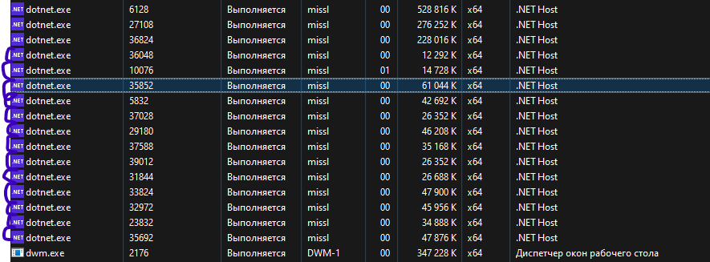

# Отчет по лабораторной работе по Тестированию №1

## Задание
1. Написать unit-тесты для компонентов доступа к данным и бизнес логики выбранного проекта

## Выполнение
1. Все классы основных компонентов покрыты тестами для каждого публичного метода
2. Представлены тесты на обработку исключений

3. Представлены тесты в классическом (без mock/stub), так и в "Лондонском" стиле

### Классический стиль

### Лондонский стиль

4. Соблюдена структура Act-Arrange-Asser (AAA) в каждом тесте, используются фикстуры и хелперы

5. Во всех секциях Act происходит один вызов метода

6. Нет тестов на приватные методы

7. Применены паттерны Data Builder и Object Mother

### Data Builder

### Object Mother

8. Настроен запуск тестов из командной строки на основании локальной копиии репозитория

Запуск тестов происходит при помощи выполнения скрипта ./make_report.ps1 в корне репозитория

9. Представлен автоматически сгенерированный отчет по результатам тестирования (allure), генерация которого учтена при запуске тестов из командной строки

Описанный выше скрипт автоматически генерирует отчет и открывает его на просмотр

10. Предусмотрен запуск тестов в случайном порядке

xUnit по-умолчанию запускает тесты в случайном порядке

11. Предусмотрен запуск тестов в режиме без доступа к интернету

Так как тестовая БД запускается локально, проверен запуск тестов с остановленным контейнером тестовой БД:

Как можно увидеть, три теста, зависящие от базы данных, не проходят

12. Проверено, сколько процессов запускается на прогон всех юнит-тестов и как это конфигурируется

Отдельный процесс запускается на каждый тест-класс, что видно из дополнительных процесов dotnet.exe:

Параллелизм тестов настраивается при помощи атрибутов уровня сборки для каждого тестового проекта, либо при помощи конфигурации, как описано в [документации xUnit](https://xunit.net/docs/running-tests-in-parallel).

13. Тесты проходят успешно

14. При написании тестов следовал принципам защиты от регресии, устойчивости к рефаторингу и легкости поддержки.