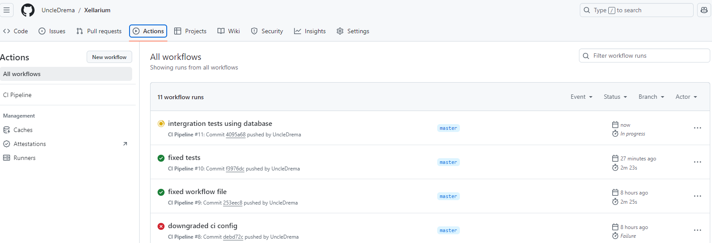
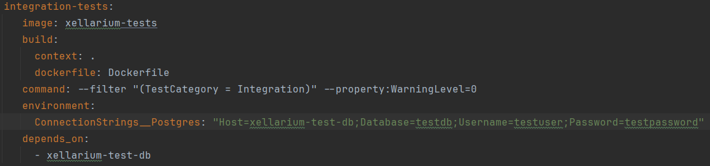
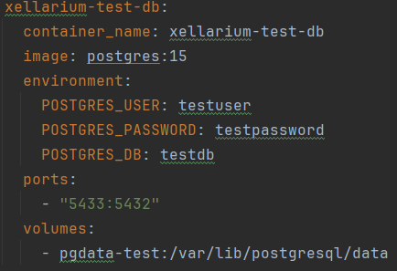
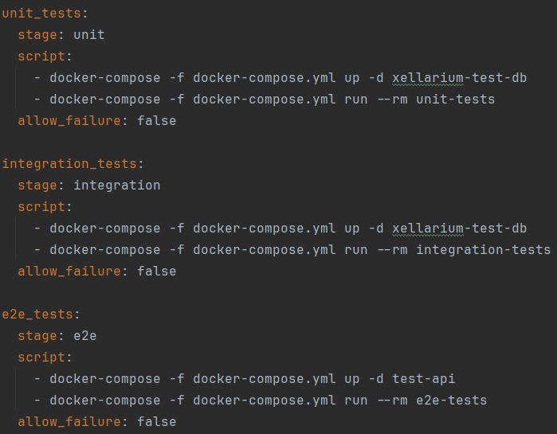
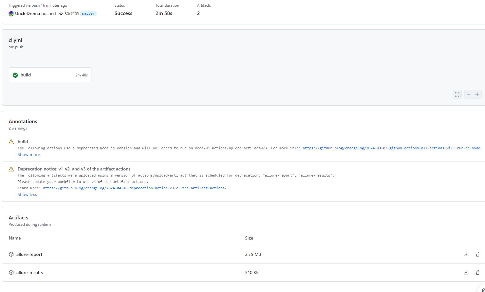
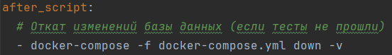

# Отчет по лабораторной работе по Тестированию №2

## Задание
1. Написать integration-тесты для компонентов доступа к данным и бизнес логики
   выбранного проекта
2. Написать E2E-тест для демонстрационного сценария (например того, который
   был бы использован при защите демонстрации minimum viable product)
3. Организовать запуск тестов из лабораторной работы №1 и вновь добавленных
   в рамках работы №2 в любой, на усмотрение студента, CI\CD среде (GitLab,
   Jenkins, TeamCity, etc.)
4. Проимитировать действия из Е2Е теста с помощью средства для отправки
   запросов, снять лог с помощью средства захвата трафика (если в проекте нет
   подобных действий, то согласовать с преподавателем что делать)

## Выполнение
1. Тесты запускаются в докер-контейнере и запускаются в CI/CD среде

2. Интеграционные тесты работают с хранилищем данных

3. Для тестов инициализируется отдельный инстанс хранилища
4. Инстанс хранилища поднимается новый

5. Порядок запуска тестов unit -> intergration -> e2e
6. Если один из этапов свалился, последующие не запускаются, помечаются как skipped, генерируется автоматические отчет

7. Откат хранилища на состояние до запуска тестов

8. Шины и очереди сообщений не используются
9. Активные сессии не хранятся
10. GUI не тестируется в E2E тестах
11. Интеграционные тесты могут быть запущены несколько раз подряд
12. Тесты могут быть запущены локально, т.к. подключается к базе в докер-контейнере
13. Тесты проходят успешно
14. Файлы с тестом размещены в соответствии с необходимой структурой
